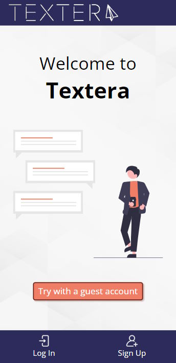
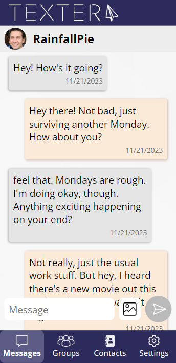
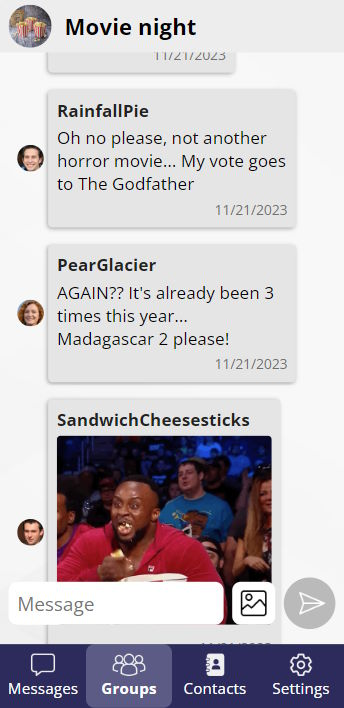
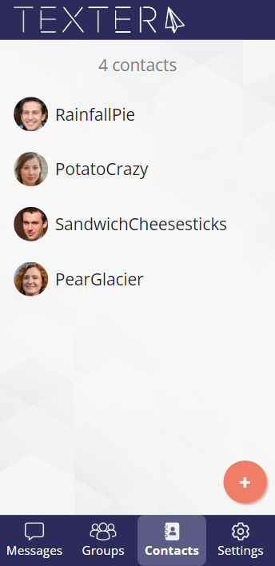
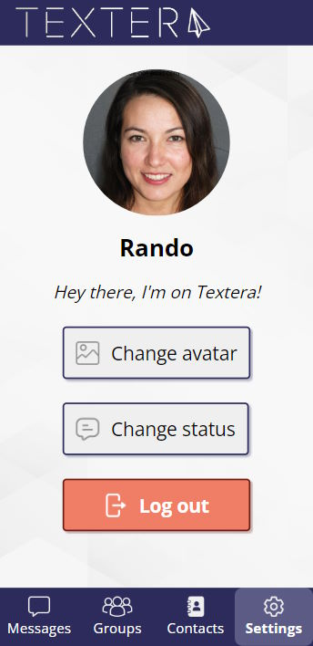

# [Textera : a messaging app built with Express and React](https://textera.netlify.app/)

This project was created as a part of The Odin Project curriculum.

Hosted on Netlify : https://textera.netlify.app/

## Screenshots
    

---

## Features
- Add users to your contacts list
- Talk with a user in a private conversation
- Talk with as many people as you want in groups
- Send image files to other users
- Customize your profile by adding a picture and writing a status
- See users/groups info with all exchanged images

## Technologies used
The backend is written with **Express** and hosted on Railway, with authentication handled by **Supabase** and data handled by **MongoDB** and **Firebase Storage**.
The web app is built using **React** and hosted on Netlify.

## What I learned
- Handling files upload in Express
- Supabase for authentication (I would have used Supabase for everything data related if I had known about it before being already deep in the project... something to keep in mind if I refactor it one day)
- Securing backend routes
- Making a UI for smartphone
- Prepare my code for hosting (backend and frontend)

## Known bugs
- When sending an image, the page needs to be refreshed for the message to display

## Credits
- Icons found on [Flaticon](https://www.flaticon.com/)
- Placeholder photos from [This Person Does Not Exist](https://this-person-does-not-exist.com/en)
